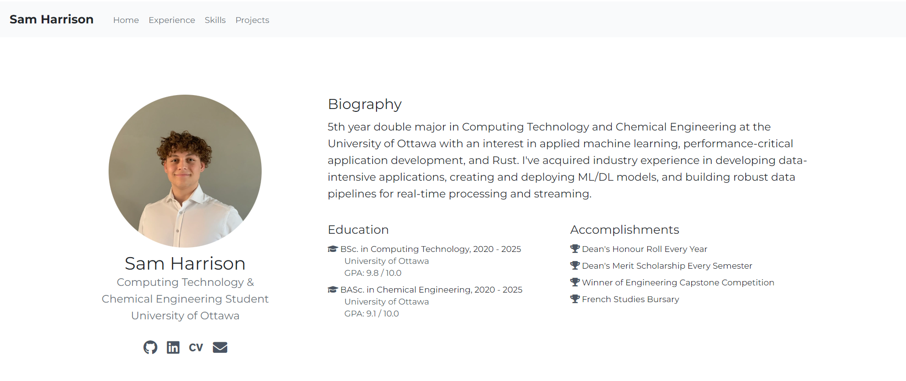
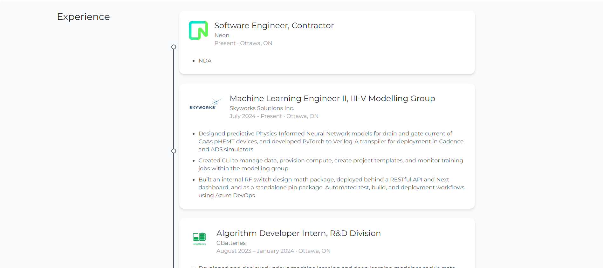
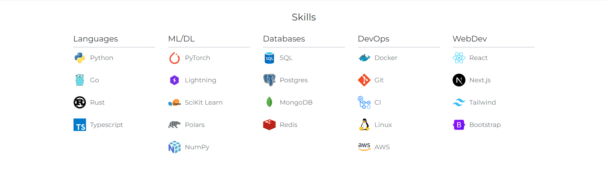
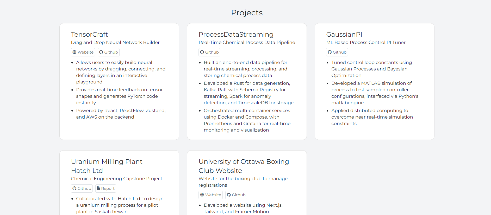

# Portfolio Website / CV

This is a personal portfolio website and CV built using **React**, **Tailwind CSS**, and **TypeScript**. The site is designed to showcase your projects, skills, and professional experience in a clean, modern layout.

## Tech Stack

- **React**
- **TypeScript**
- **Tailwind CSS**

## Sections

- **Landing**: 
  - Contains a short biography, a professional headshot, and links to other websites (e.g., LinkedIn, GitHub, etc.).
  
  
- **Experience**: 
  - A vertical timeline that displays your work experience, including job titles, companies, and timeframes.
  

- **Skills**: 
  - Organized into categorized columns. Uses Devicon to display technical skills with their corresponding logos (e.g., Rust, React, Docker).
  

- **Projects**: 
  - Project cards displaying the title, description, and links to relevant websites (e.g., live project, GitHub repository, etc.).
  


## Using it for your own website

### Prerequisites

Make sure you have **Node.js** and **npm** (or **yarn**) installed.

### Installation

1. Clone the repository:
    ```bash
    git clone https://github.com/sam-harri/CurriculumVitae.git
    ```

2. Navigate to the project directory:
    ```bash
    cd CurriculumVitae
    ```

3. Install dependencies:
    ```bash
    npm install
    ```

4. Start the development server:
    ```bash
    npm run dev
    ```

5. Open your browser and go to:
    ```
    http://localhost:5173
    ```
